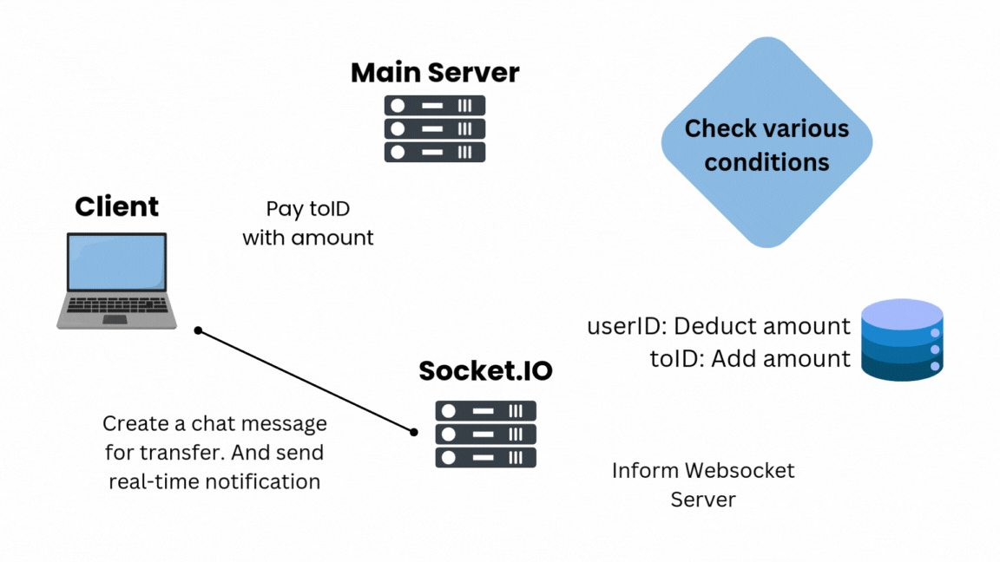
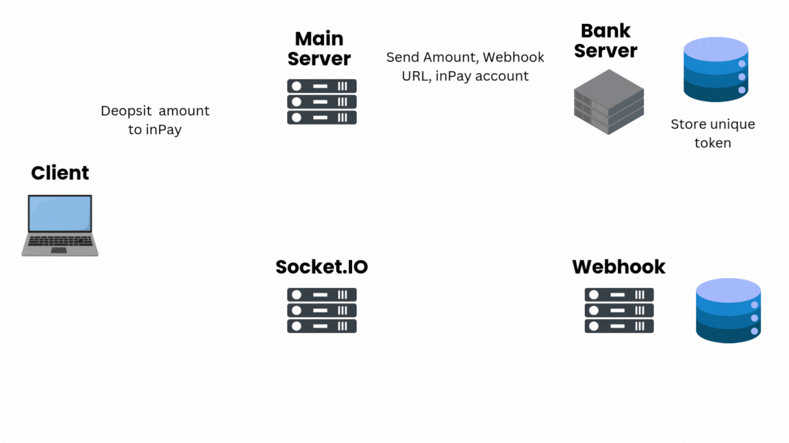

# WORKING

This explains the internal architecture and working of inPay.

## Transfer

  

- User sends a payment request to the **Main Server** using the recipient's ID.
- The server performs validity checks, such as verifying available balance and ensuring a positive transfer amount. If passed, the amount is deducted from the sender and transferred to the recipient, all within a single database transaction.
- The **Websocket server** is then notified of the transaction result. This sends real-time in-app notification to both users if they're online.

## Deposit

  

- User specifies the amount and sends a deposit request, selecting their **preferred bank**.
- The **Main Server** posts a request to the bank with the amount, inPay's Webhook URL, and admin bank account details.
- The bank server responds and stores a unique AES-128bit encrypted token with the received data as payload.
- Once the user receives the token from the Main Server, the bank website opens, containing the token in URL. After email verification through OTP, the bank receives the final deposit request.
- The bank server then sends the transaction result to the Webhook server. The Webhook pushes the transaction to a queue. A worker processes the transaction and updates the user's balance and transaction status accordingly.
- Finally, the result is sent to the user via the Websocket server.

## Balance History

Coming soon..
